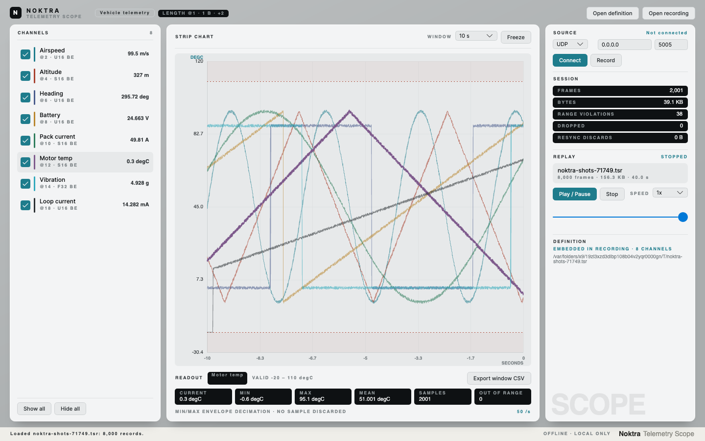
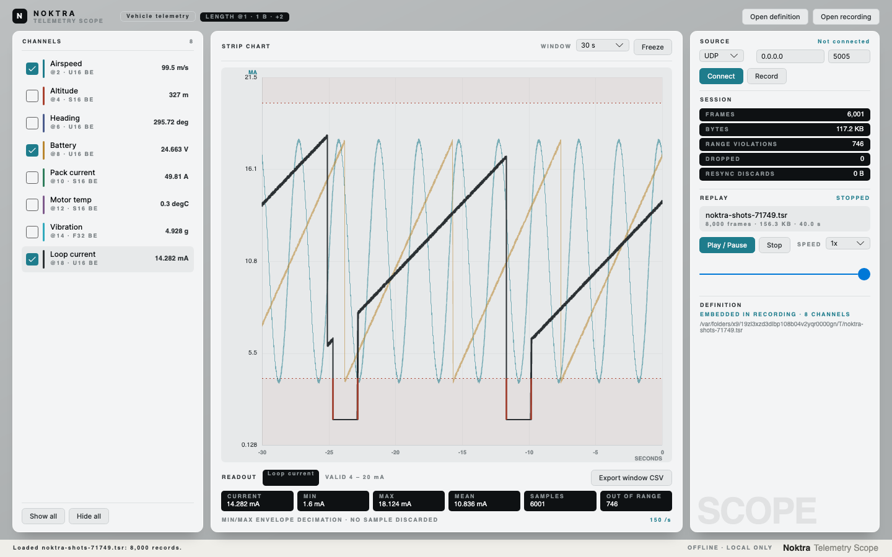

# Noktra Telemetry Scope

**One channel definition file. Live strip chart, recording, and replay — offline, on your machine.**

Point it at a UDP port or a serial line, hand it a YAML file describing how bytes become numbers,
and watch. Capture the session to disk, then play it back at 0.1x to 10x through *the same decode
path* the live data took — so what you see on replay is what the capture saw, not a second opinion
about it.

Free tools will plot a serial stream. Almost none of them will record it and give it back to you
later at the right speed. That is the gap this fills.



---

## What it does

| | |
|---|---|
| **Channel definition** | One YAML file: framing (fixed / length-field / delimiter) and fields (offset, type, endianness, `a·raw + b` scale, unit, valid range) |
| **Receive** | UDP and serial, decoded to engineering units, out-of-range readings flagged |
| **Strip chart** | Many traces, 5 s – 5 min window, min/max envelope decimation, freeze, cursor read-out |
| **Record** | Raw frames plus receive timestamps, streamed to `.tsr` while they arrive |
| **Replay** | Play a `.tsr` back at its original pace, 0.1x – 10x, scrub anywhere |
| **Statistics & export** | Current / min / max / mean over the visible window, and CSV of exactly that window |

Everything runs locally. There is no account, no telemetry, and no network call the operator did
not ask for — which is the point when the machine lives on a closed network.

---

## Quick start

Download the Windows build from [Releases](../../releases), or build from source:

```bash
git clone https://github.com/Kim-Hakseong/NOKTRA-telemetry-scope.git
cd NOKTRA-telemetry-scope
dotnet build
```

### 1. Try it without hardware

The repository ships a test transmitter that emits frames matching any definition you give it:

```bash
# terminal 1 — transmit on UDP 5005 at 200 Hz
dotnet run --project tools/Ts.TestSender -- \
    --definition samples/vehicle-telemetry.yaml --udp 127.0.0.1 5005 --rate 200

# terminal 2 — open the scope already connected
dotnet run --project src/Ts.App -- \
    --definition samples/vehicle-telemetry.yaml --connect
```

Eight channels start scrolling. Press **Record**, let it run, press it again, then **Open
recording** and **Play / Pause** to watch the same data come back.

### 2. Point it at your own stream

1. Copy `samples/vehicle-telemetry.yaml` and edit it to match your frames — see
   [docs/channel-definition.md](docs/channel-definition.md).
2. **Open definition**, choose the file.
3. Pick **UDP** and a port, or **Serial** and a port and baud rate. Press **Connect**.

### 3. Record and replay

- **Record** asks for a file and starts writing immediately. Frames are captured raw, before
  decoding, so a capture stays useful even if the definition turns out to be wrong.
- **Open recording** loads a `.tsr`. The definition it was captured under travels inside the file,
  so a recording still replays correctly years later.
- Drag the position slider to scrub. The chart fills with the window leading up to the handle
  rather than going blank.

### Command line

```
Ts.App [options]

  --definition <file.yaml>   load a channel definition at startup
  --open <file.tsr>          load a recording at startup
  --connect                  start receiving straight away
  --udp-port <n>             override the definition's UDP port
  --serial <name>            receive from this serial port instead
```

---

## The channel definition

```yaml
name: Vehicle telemetry

source:
  type: udp
  port: 5005

framing:
  mode: lengthField     # fixed | lengthField | delimiter
  headerLength: 2
  lengthOffset: 1
  lengthSize: 1
  adjust: 2             # the length counts the payload only, so add the header back

channels:
  - name: Loop current
    offset: 18
    type: u16           # u8 s8 u16 s16 u32 s32 u64 s64 f32 f64
    endian: big
    a: 0.001            # value = a x raw + b
    unit: mA
    min: 4              # valid range, in engineering units
    max: 20
```

Nothing about the wire is assumed. Byte order, whether a length field counts its own header,
whether a delimiter stays in the frame — the file states it, or the read fails with a line number.
`adjust` exists because encodings genuinely disagree about what a length counts, and guessing is
how a decoder ends up quietly wrong.

Full reference: [docs/channel-definition.md](docs/channel-definition.md) ·
[docs/tsr-format.md](docs/tsr-format.md)

---

## Out-of-range readings

A channel with declared limits is drawn against them. When a reading leaves the range, the
offending segment — not the whole curve — is redrawn in the alert colour, so the excursion is
located in time rather than merely announced.



Colour is never the only signal: the channel row carries an `UNDER` or `OVER` label and the
read-out counts the samples. And the limits are a floor for the axis, never a ceiling — a value
outside them is exactly the value someone needs to see.

---

## Design notes

**Min/max envelope decimation.** Averaging or sampling every *n*th point is faster to write and
wrong for this job: both erase the single-sample spike that is usually why someone is watching.
Keeping the minimum and maximum of each pixel column preserves every excursion at any zoom, so a
glitch stays visible after a million samples are squeezed into eight hundred pixels.

**One pipeline.** A frame from a socket, a serial port or a replayed file arrives at the same place
as the same thing: a timestamp and some bytes. There is one decoder, so "replay looks exactly like
the live capture" is structural rather than aspirational.

**Recorded before decoded.** The recorder sees the wire, not this build's interpretation of it. A
capture taken under a wrong definition can be re-read under a corrected one without losing a bit.

**Torn files are normal.** A `.tsr` has no index and no trailer, because both are the parts missing
from a file that ended badly — and a capture matters most when it stopped badly. The reader
consumes records until one is incomplete, then stops and says so.

**Nothing blocks the wire.** Receivers only read and hand frames to a bounded queue; decoding and
drawing happen on a fixed 50 ms beat on the other side of it. When the queue overflows the oldest
frame is dropped and counted, because a number on screen saying frames were lost is worth far more
than a chart quietly showing less than it received.

---

## Building

Requires the [.NET 8 SDK](https://dotnet.microsoft.com/download).

```bash
dotnet build                 # everything
dotnet test                  # 137 tests, no network, no sleeps
dotnet run --project src/Ts.App
```

A Windows release build:

```bash
dotnet publish src/Ts.App -c Release -r win-x64 --self-contained true \
    -p:PublishSingleFile=true -p:IncludeNativeLibrariesForSelfExtract=true
```

Developed on macOS, published for Windows. The UI is Avalonia, so it runs on both.

### Layout

```
src/Ts.Core/     definition, decoding, framing, recording, replay, transport — no UI
src/Ts.App/      Avalonia application
tools/           test transmitter, screenshot renderer
tests/           xUnit
samples/         an example channel definition
```

`Ts.Core` has no UI dependency and no static clock: everything time-dependent takes an `IClock`, so
replay timing is asserted exactly rather than slept for.

---

## Status

Working and tested. The scope, the recorder and the replay engine all do what this page says.
Known limits: TCP is not implemented, only one source can be open at a time, and there are no
derived channels yet.

---

## License

MIT — see [LICENSE](LICENSE).

**Noktra** — verification tools that work in the dark (offline-first).
